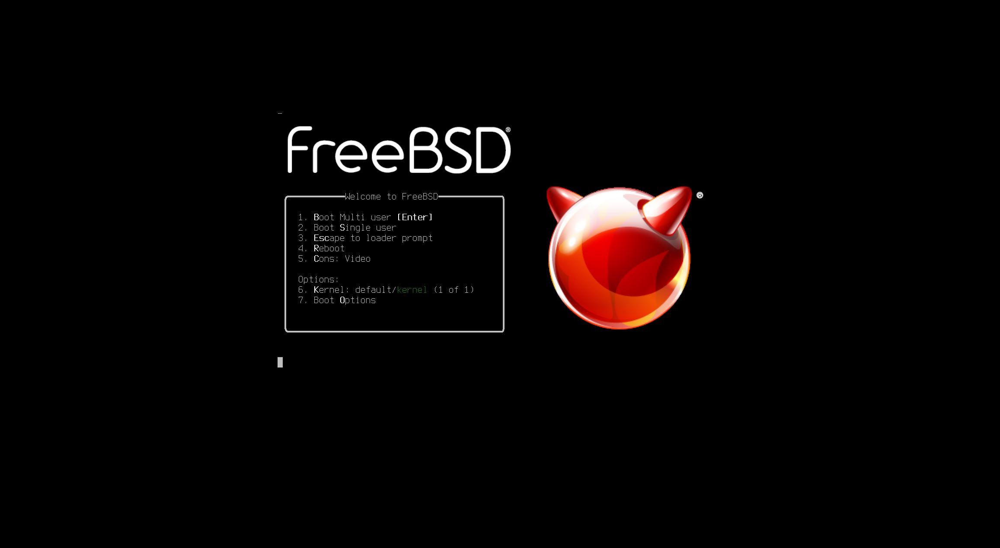
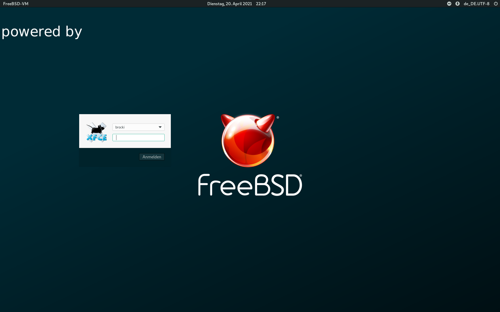

# FreeBSD Dektop with Xfce

This script installs a Xfce 4.16 desktop environment with Arc and Matcha Gtk Themes on FreeBSD 12.2, 13.0

Display drivers: Only the current nvidia (440.xx series) and VMware display drivers are supported. When VMware is used, the screen size variable must be set to your needs.
Default: 2560x1440

Applications: Audacious, Catfish, doas, Glances, GNOME Archive manager, Firefox, Gimp, htop, KeePassXC, LibreOffice, lynis, mpv, neofetch, OctoPkg, Ristretto, rkhunter, Shotweel, sysinfo, Thunderbird, VIM, VLC.

Language and country code is set to German. It can be changed to your need in
the user defined variables section.


## Getting Started

It is recommended that you start with a clean installation of FreeBSD 13.0 64-bit. Your user account should belong to the operator and wheel group so that administrative tasks can be performed.

### Prerequisites

- Installation of FreeBSD 13.0-RELEASE-amd64
- Display card: nvidea video card (440.xx series display driver) or installation on  VMWare
- Regular user account that belong to the operator and wheel group

### Installing

Log in with your user account in a clean FreeBSD installation and download the install script from github. Then change the file permissions so that the installation script can be executed:

```
$ fetch --no-verify-peer https://raw.githubusercontent.com/ibrockmann/freebsd-xfce-desktop/main/install-xfce.sh
$ chmod u+x install-xfce.sh
```

The install script must be run as root, therefore switch to root ([su](https://www.freebsd.org/cgi/man.cgi?query=su&apropos=0&sektion=0&manpath=FreeBSD+13.0-current&arch=default&format=html)) before you run it:

```
# ./install-xfce.sh | tee -a ./install-xfce.log
```

Follow the instructions on screen. If you made a mistake answering the questions, press  CTL+C to abort the script. Afterwards run it again.


## Screenshots






## Testing

The installation was only tested with the current nvidia drivers and under VMware on a desktop PC.

## License

This project is licensed under the BSD 3 License - See ``LICENSE`` for more information.

## Acknowledgments

[kamila.is](https://kamila.is/making/freebsd-wallpapers/) for the FreeBSD/Beastie wallpapers
