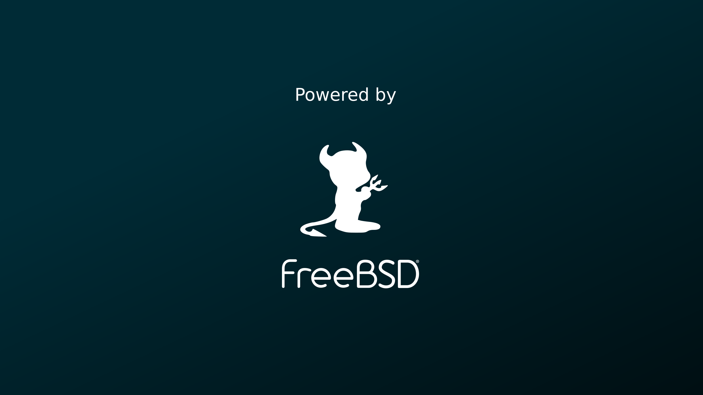
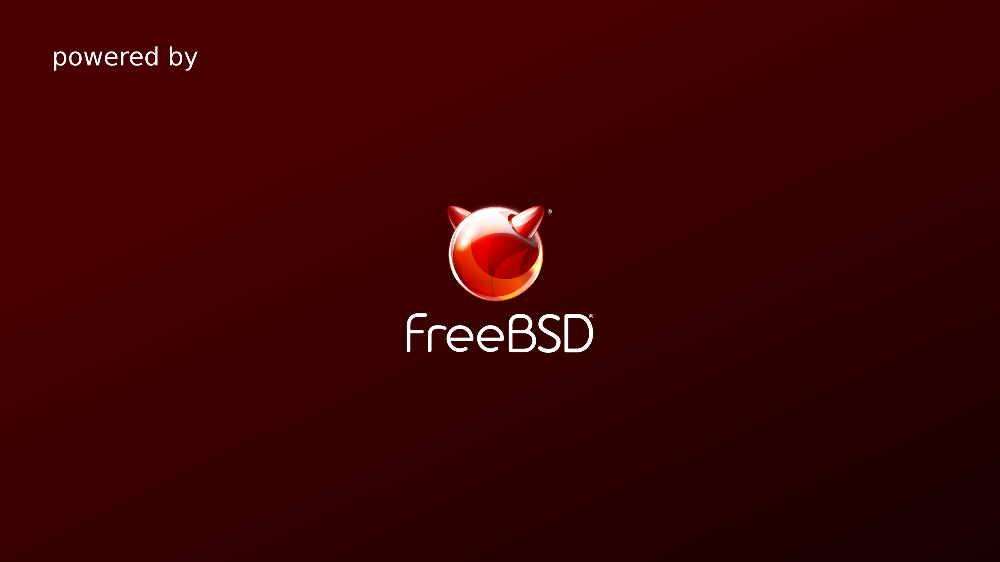
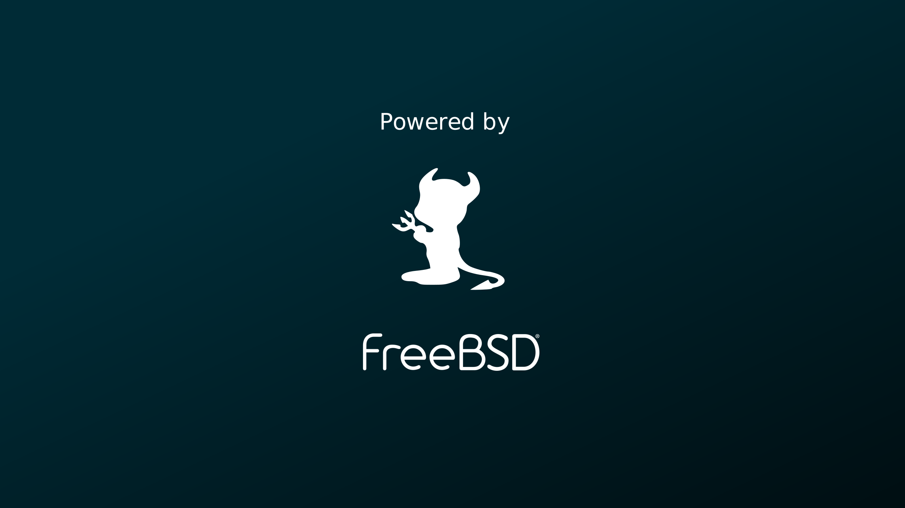
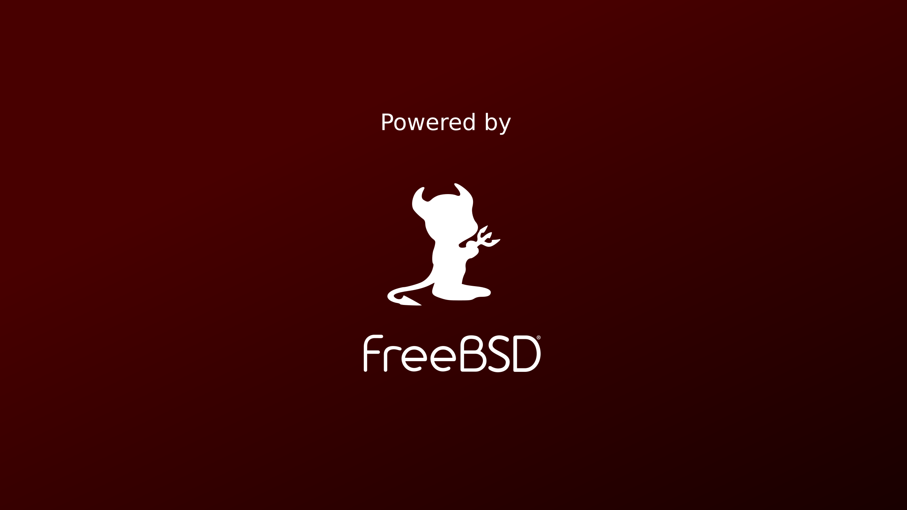

# FreeBSD Wallpapers

A few quick variations of a FreeBSD/Beastie wallpaper.

<left>

<left> 



SVG source files (use this if you want to modify the wallpapers): [v1.svg](FreeBSD-lockscreen_v1.svg), [v2.svg](FreeBSD-lockscreen_v2.svg), [v3.svg](FreeBSD-lockscreen_v3.svg), [v4.svg](FreeBSD-lockscreen_v4.svg)

Here's a neat trick: If you want a different background colour, you can do it from the command line! Download the SVG files, install ImageMagick and use the following command:

```sh
convert -quality 100 -background <colour> <source>.svg wallpaper.png
```

For example, the blue wallpaper I use on my laptop was created by this command:

```sh
convert -quality 100 -background '#002b36' v3.svg v3-blue.png
```

That way you can easily match it with your theme :-)

I made these to celebrate that FreeBSD runs surprisingly well on my laptop. I should write about that some day!

The FreeBSD logos come from [the FreeBSD Foundation website](https://www.freebsdfoundation.org/about/project/).
Forked from [kamila.is](https://kamila.is/making/freebsd-wallpapers/).

License: [CC BY 2.0](https://creativecommons.org/licenses/by/2.0/)